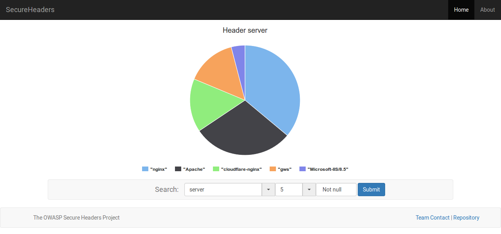

<a href="https://codeclimate.com/github/amenezes/headers"></a>
[](https://travis-ci.org/amenezes/headers)
[](https://gemnasium.com/github.com/amenezes/headers)

## HTTP response headers
HTTP headers are well known and also despised. Seeking the balance between usability and security developers implement functionality through the headers that can make your more versatile or secure application.  

But in practice how the headers are being implemented? What sites follow the best implementation practices? Big companies, small, all or none?  

### Description
A python script to get all response headers from a file and store in a MySQL database.  

##### Usage:  
```
$ python headers.py -h  

usage: headers.py [-h] [-f FILENAME] [-t THREADS]  

Headers will get all response headers from Alexa top sites.
optional arguments:
  -h, --help                        show this help message and exit.  
  -f FILENAME, --filename FILENAME  filename with list of sites.  
  -t THREADS, --threads THREADS     number of threads to make parallel requests.  
```

##### Standard output sample:  
```
$ python headers.py -f topsites_global.csv -t 200
Thread pool 1 (0 - 200)
Thread pool 2 (200 - 400)
Thread pool 3 (400 - 600)
Thread pool 4 (600 - 800)
Thread pool 5 (800 - 1000)

Connections summary
https: 366
http: 579
error: 55

Cleaning database
Tables: [header, site, header_value, header_name]

Populating MySQL tables
Table: site
Table: header_value
Table: header_name
Table: header
```
##### Dependencies  

List of dependencies:  

Python Libs | PHP | Web-Server
------------ | ------------- | -------------
gevent | php5 | apache2
mysql-connector | php5-mysqlnd | nginx
argparse | -  | lighttpd

##### Installation
* option 1 (_with pip_)  
```[sudo] pip install -r requirements-txt```  

* option 2  
```[sudo] python setup.py install```  

## Application Structure

### headers.py
A python script to get all response headers from a file and store result in a MySQL database.  

### conf  

##### topsites_global.csv
Just an Alexa top sites file example with 1000 records.  

#### sql  
##### headers.sql  
MySQL database scheme exported with the command below:  
```$ mysqldump -u root -p --no-data headers header header_name header_value site > headers.sql```  

To import you can use this command:  
```
$ echo "create database headers" | mysql -u root -p
$ mysql -u root -p headers < conf/sql/headers.sql
```
This is the database structure:  


##### headers-topsites_global.sql
MySQL database with 1000 sites exported with the command below:  
```$ mysqldump -u root -p headers header header_name header_value site > headers-top-1k.sql```  

To import you can use this command:  
```$ mysql -u username -p headers < headers-top-1k.sql```

### html
PHP pages with Highcharts graphics.  

Sample page:  

